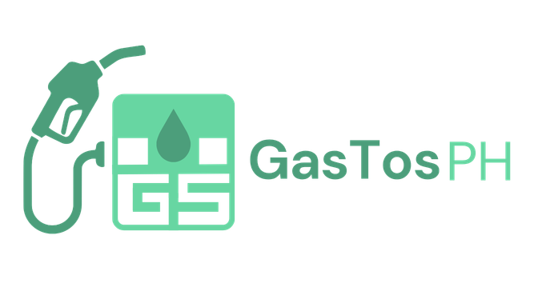

<p align="center">
  
</p>

<h1 align="center">GasTos PH</h1>
<p align="center"><strong>Fuel Cost Calculator & Live Prices — Philippines</strong></p>

<p align="center">
  
  
  
  
</p>

---

> 📚 This project was made as a school requirement for the subject **Current Trends and Topics in Computing**.

---

## 📖 About

**GasTos PH** is a web-based fuel cost calculator and live price tracker designed for Filipino drivers. It helps users estimate how much they'll spend on gas for any trip across the Philippines, with real-time DOE-based fuel prices, an interactive map, and station comparisons — all in one place.

## ✨ Features

- **Fuel Cost Calculator** — Simple, Advanced, and Compare modes for flexible trip cost estimation
- **Vehicle Type Picker** — Select your vehicle (motorcycle, car, van, truck, jeepney, hybrid) and the fuel type dropdown automatically filters to only compatible fuel types
- **Interactive Map** — Search any location in the Philippines, set origin and destination, and get road or straight-line distance estimates via OpenStreetMap
- **Live Fuel Prices** — Weekly DOE price advisory data across all Philippine regions
- **Station Locator** — Find nearby gas stations within 3 km of any location
- **Station Price Comparison** — Compare fuel prices across Shell, Petron, Caltex, Seaoil, Phoenix, Flying V, Cleanfuel, and Jetti
- **Community Reports** — Submit and vote on crowd-sourced pump price reports
- **Autocomplete Search** — Barangay, street, and landmark-level search powered by Nominatim/OpenStreetMap

## 🛠️ Tech Stack

| Technology | Purpose |
|---|---|
| HTML5 / CSS3 / Vanilla JS | Core frontend |
| [Leaflet.js](https://leafletjs.com/) | Interactive maps |
| [Leaflet Routing Machine](https://www.liedman.net/leaflet-routing-machine/) | Road routing |
| [OpenStreetMap / Nominatim](https://nominatim.org/) | Geocoding & search |
| [Overpass API](https://overpass-api.de/) | Nearby station data |
| [OSRM](http://project-osrm.org/) | Road distance calculation |
| [CARTO Dark Matter](https://carto.com/) | Map tile styling |
| DOE Philippines | Weekly fuel price data |

## 🚀 Getting Started

No build tools or installations needed. Just open the file in a browser.

```bash
git clone https://github.com/your-username/gastos-ph.git
cd gastos-ph
# Open index.html in your browser
```

> For full map and search functionality, serving via a local server (e.g. VS Code Live Server) is recommended over opening the file directly.

## 📁 Project Structure

```
gastos-ph/
├── index.html
├── assets/
│   └── gastos-ph-logo.png
├── css/
│   └── styles.css
└── js/
    ├── data.js        # Fuel price data (DOE weekly)
    ├── ui.js          # Rendering, navigation, toast
    ├── map.js         # Leaflet maps & station locator
    ├── autocomplete.js # Nominatim search
    ├── calculator.js  # Fuel cost logic
    └── main.js        # App entry point
```

## 📊 Data Sources

- **Fuel prices** — [DOE Philippines](https://www.doe.gov.ph/) weekly price advisory
- **Map & geocoding** — [OpenStreetMap](https://www.openstreetmap.org/) / Nominatim
- **Station locations** — OpenStreetMap via Overpass API

---

<p align="center">Made with ⛽ for Filipino drivers</p>
